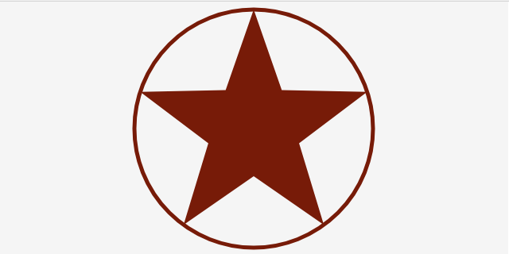

# CreateJSでES2015のclassを利用する（継承）

JavaScriptではオブジェクト指向としてのクラスが利用できます。クラスを利用すると、CreateJSを構造的に設計しやすくなります。

例えば、カーゲームを想像してみましょう。カーゲームには様々な表示物が登場します。自機、敵機、コース、背景など。これらを一つのJavaScriptファイルで管理するのは難しいと言わざるを得ません。一つのソースコードに異なる表示物のプロパティーや変数が乱立し、管理が大変になるでしょう。

クラスだと、自機を一つのクラス、敵機を一つのクラス・・・と分離することができます。そうすれば、自機を開発しているときは、他のオブジェクトのことを気にせず安心して開発に取り掛かれます。結果として、長いコードを書いたときの生産性・可読性・保守性が向上するでしょう。

クラスは、ECMAScript 2015（略称：ES2015、ES6）仕様の`class`キーワードを利用します。クラスの仕様の説明は割愛しますので、知らない人は別途参考資料を読んでください。


## メッシュのサブクラスを作る

クラスの手軽な使いみちとして、シェイプのサブクラスを作ってみましょう。次のサンプルでは適当なシェイプを表示したものです。



- [サンプルを再生する](https://ics-creative.github.io/tutorial-createjs/samples/class_shape.html)
- [サンプルのソースコードを確認する](../samples/class_shape.html)


このサンプルでは、自作の`MyStar`クラスのメッシュを`createjs.Shape`クラスのサブクラスとして作成しています。`createjs.Shape`クラスを継承するには、クラス宣言に`extends createjs.Shape`と記述します。そうすれば、自作の`MyStar`クラスは`createjs.Shape`を継承したクラスとして定義されます。

```js
/** シェイプを継承した自作の星のクラスです。 */
class MyStar extends createjs.Shape {
}
```

コンストラクター`constructor()`では、適当な図形を描きます。このクラスはシェイプクラスを継承しているので、`this.graphics`というように`this`で参照するのが重要です。`super()`メソッドは`constructor()`メソッド内で必ず実行する必要があります。


```js
class MyStar extends createjs.Shape {
  constructor() {
    super();

    // 円を作成します
    this.graphics.beginStroke("Purple");// 線の色を指定
    this.graphics.setStrokeStyle(5);// 線の幅を指定
    this.graphics.drawCircle(0, 0, 150); // 半径150pxの円を記述
    this.graphics.endStroke();

    // 多角形を作成します
    this.graphics.beginFill('Purple'); // 塗りの色を指定
    this.graphics.drawPolyStar(0, 0, 150, 5, 0.6, -90); // 半径150pxの星を記述
    this.graphics.endFill();
  }
}
```

こうすれば、図形を利用するときにわざわざメイン関数`init()`で描かなくてもも、`new MyStar()`と記述するだけで図形を表示できるようになります。


```js
// オリジナルのクラスから、インスタンスを作る
var myStar = new MyStar();
// ステージに配置する
stage.addChild(myStar);
```

サンプルのソースコードを見ると、`init()`関数の中身がシンプルになり、読みやすくなりましたね。

```js
function init() {
  // Stageオブジェクトを作成。表示リストのルートになります。
  var stage = new createjs.Stage('myCanvas');

  // オリジナルのクラスから、インスタンスを作る
  var myStar = new MyStar();
  // ステージに配置する
  stage.addChild(myStar);

  // 適当なところに配置
  myStar.x = 320;
  myStar.y = 160;

  // Stageの描画を更新
  stage.update();
}
```

## コンテナーのサブクラスを作る

クラスのよくある利用方法として、CreateJSのコンテナーにもクラスを使ってみましょう。次のサンプルは複数のシェイプを一つのコンテナーにまとめたものです。


- [サンプルを再生する](https://ics-creative.github.io/tutorial-createjs/samples/class_container.html)
- [サンプルのソースコードを確認する](../samples/class_container.html)


グループのサブクラスを作るには、クラス宣言に`extends createjs.Container`と記述します。すると、このクラスは`createjs.Container`クラスを継承したものとして定義されます。

```js
/** コンテナーを継承したサブクラスです。 */
class MyContainer extends createjs.Container {
}
```

コンテナー化したい内容をコンストラクターへ記述していきます。このサンプルだと、円と星を作成してグループに追加しています。なお追加するときは、`createjs.Container`クラスを継承しているので、`this.addChild()`メソッドを実行します。`addChild()`メソッドで追加する場所は`this`であることに注目ください。

```js
/** コンテナーを継承したサブクラスです。 */
class MyContainer extends createjs.Container {
  constructor() {
    super();

    // 円を作成します
    var circle = new createjs.Shape();
    circle.graphics.beginStroke("DarkRed");// 線の色を指定
    circle.graphics.setStrokeStyle(5);// 線の幅を指定
    circle.graphics.drawCircle(0, 0, 150); // 50pxの星を記述
    this.addChild(circle); // 表示リストに追加

    // 多角形を作成します
    var poly = new createjs.Shape();
    poly.graphics.beginFill('DarkRed'); // 赤色で描画するように設定
    poly.graphics.drawPolyStar(0, 0, 150, 5, 0.6, -90); // 150pxの星を記述
    this.addChild(poly); // 表示リストに追加
  }
}
```

利用したい場所では`new MyContainer()`と呼び出すだけです。

```js
// クラスからインスタンス化する
const myContainer = new MyContainer();
// ステージに自作のコンテナーを追加する
scene.addChild(myContainer);
```

これも`init()`関数の中身がシンプルになり、読みやすくなりましたね。

```js
function init() {
  // Stageオブジェクトを作成。表示リストのルートになります。
  var stage = new createjs.Stage('myCanvas');

  // クラスからインスタンス化する
  const myContainer = new MyContainer();
  // ステージに自作のコンテナーを追加する
  stage.addChild(myContainer);
  // 適当な座標に配置する
  myContainer.x = 320;
  myContainer.y = 160;

  // Stageの描画を更新
  stage.update();
}
```

この解説は[CreateJSでES2015のclassを利用する（メソッド）](class_method.md)に続きます。

<article-author>[池田 泰延](https://twitter.com/clockmaker)</article-author>
<article-date-published>2018-02-28</article-date-published>
<article-date-modified>2018-02-28</article-date-modified>
